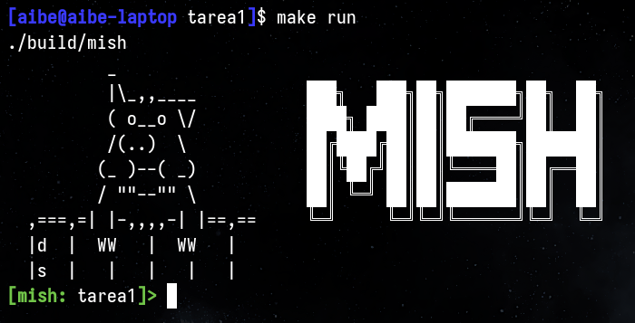

# Tarea 1 - Sistemas Operativos 2025-2



## Descripción

Implementación de shell básica UNIX **mish** en C.

### Features

- [x] Ejecutar comandos simples
- [x] Mostrar directorio actual en prompt
- [x] Soportar pipelines, listas y redireccionamientos (<, >, >>)
- [x] Implementación de GNU readline
  - [Edición de linea de comandos](https://readline.kablamo.org/emacs.html)
  (`C-u`: elimina todo hasta el inicio)
  - [Historial de comandos](https://tiswww.cwru.edu/php/chet/readline/readline.html#Searching) (acceder via `C-r`)
  - [Auto completado](https://tiswww.cwru.edu/php/chet/readline/readline.html#Commands-For-Completion) (completar nombres utilizando `TAB`)
- [x] Agregar comandos builtin (`cd`, `exit`, `help`, `history`, etc)
- [x] miprof

### Alumnos

- Alonso B.
- Constanza C.
- Cristóbal F.
- Daniel S.

## Uso

### Requisitos

- gcc
- git
- GNU make
- GNU readline

> [!NOTE]
> Comandos para instalar dependencias:
> - Ubuntu/Debian: `sudo apt install gcc git make libreadline-dev`
> - Fedora/RHEL: `sudo dnf install gcc git make readline-devel`

### Comandos

Utiliza estos comandos para obtener el código, compilarlo y ejecutarlo:

```sh
git clone https://github.com/Ado-do/tarea1-so.git
cd tarea1-so
make run
```

Para probar `miprof` referirse a [test/README.md](test/README.md)
